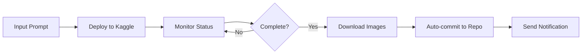

  [](https://github.com/leweex95/imggenhub/actions/workflows/kaggle_regression_test.yml) [](https://github.com/leweex95/imggenhub/actions/workflows/image_generation.yml)

# ImgGenHub

**A personal, cost-efficient AI image generation platform.**

ImgGenHub is a personal image generation hub that connects to web-based image generation services, currently featuring a fully automated Kaggle-based pipeline with plans for multi-platform support.

---

## Features

### **Current functionality**

#### **Kaggle-powered image generation**
- **Automated pipeline**: Deploy → Monitor → Download workflow
- **GPU/CPU support**: Configurable hardware acceleration via Kaggle's free T4×2 GPUs (30 hours/week)
- **Multiple models**: Support for popular Stable Diffusion variants
- **Flexible prompting**: Command-line prompts or JSON file batch processing

#### **GitHub Actions automation**
- **On-Demand generation**: Manual workflow triggers with custom parameters
- **Automated testing**: Daily regression tests to ensure pipeline stability
- **Email notifications**: Success/failure alerts with generation details

---

## Requirements

- **Python**: 3.11 or higher
- **Poetry**: For dependency management  
- **Kaggle Account**: With API credentials configured
- **Git**: For repository management

---

## Installation

### **1. Clone the repository**
```bash
git clone https://github.com/leweex95/imggenhub.git
cd imggenhub
```

### **2. Install dependencies**
```bash
pip install poetry

# Install project dependencies
poetry install
```

### **3. Configure Kaggle credentials**
```bash
# Create Kaggle credentials directory
mkdir -p ~/.kaggle

# Add your credentials to ~/.kaggle/kaggle.json
{
  "username": "your_kaggle_username",
  "key": "your_kaggle_api_key"
}

# Set proper permissions
chmod 600 ~/.kaggle/kaggle.json
```

> **Tip**: Get your Kaggle API credentials from [kaggle.com/settings](https://www.kaggle.com/settings) → Create New API Token

---

## Usage

### **Local usage**

#### **Simple single prompt**
```bash
poetry run python -m imggenhub.kaggle.main \
  --prompt "A photorealistic cat in space, 4K quality" \
  --gpu \
  --model_name "stabilityai/stable-diffusion-xl-base-1.0" \
  --dest ./my_images
```

#### **Batch processing with JSON**
```bash
# Create prompts.json
cat > prompts.json << EOF
[
  "A futuristic city skyline at sunset, cyberpunk style",
  "A serene mountain landscape with aurora borealis",
  "A vintage cafe scene with warm lighting"
]
EOF

# Run batch generation
poetry run python -m imggenhub.kaggle.main \
  --prompts_file prompts.json \
  --gpu \
  --dest ./batch_images
```

#### **Available CLI options**
```bash
poetry run python -m imggenhub.kaggle.main --help
```

**Key parameters:**
- `--prompt`: Single prompt string
- `--prompts_file`: JSON file with multiple prompts  
- `--model_name`: Hugging Face model ID
- `--gpu`: Enable GPU acceleration
- `--dest`: Output directory
- `--notebook`: Custom notebook path
- `--kernel_path`: Kaggle kernel configuration directory

### **☁️ GitHub Actions usage**

#### **🎨 On-demand image generation**
1. Go to **Actions** → **Image generation**
2. Click **Run workflow**  
3. Configure parameters:
   - **Prompt**: Your image description
   - **Platform**: Currently "kaggle" (more coming soon!)
   - **Model**: Choose from supported Stable Diffusion models
   - **GPU**: Enable for faster generation
   - **Destination**: Output folder name

#### **🔍 Automated testing**
- **Daily regression tests** run automatically at midnight UTC
- **Manual testing** available via **Actions** → **Kaggle pipeline regression test**
- Tests validate deployment, monitoring, and cleanup without consuming resources

---

## Architecture

### **Project structure**
```
imggenhub/
├── src/imggenhub/kaggle/           # Kaggle platform integration
│   ├── main.py                     # CLI entry point and pipeline orchestration
│   ├── core/                       # Core functionality
│   │   ├── deploy.py              # Kernel deployment logic
│   │   └── download.py             # Output retrieval
│   ├── utils/                      # Utilities
│   │   ├── poll_status.py         # Status monitoring
│   │   └── prompts.py             # Prompt processing
│   ├── config/                     # Configuration files
│   │   ├── kernel-metadata.json   # Kaggle kernel settings
│   │   ├── prompts.json           # Sample prompts
│   │   └── *.ipynb                # Jupyter notebook template
│   └── data/                       # Data files
├── .github/workflows/              # CI/CD automation
│   ├── image_generation.yml       # On-demand generation workflow
│   ├── kaggle_regression_test.yml  # Daily testing workflow
│   └── dist_cleanup.yml           # Maintenance workflow (cleanup)
├── output_images/                  # Generated images (auto-created)
├── tests/                          # Test suite
└── pyproject.toml                  # Project configuration
```

### **Pipeline flow**


### **Supported models**
- `stabilityai/stable-diffusion-xl-base-1.0` (default)
- `runwayml/stable-diffusion-v1-5`
- `stabilityai/stable-diffusion-2-1`  
- `CompVis/stable-diffusion-v1-4`

> **⚠️ Note**: Only public Hugging Face models are supported. Gated models require authentication that's currently incompatible with Kaggle's containerized environment.

---

## Configuration

### **Required secrets (for GitHub Actions)**
```bash
# Kaggle API credentials
KAGGLE_USERNAME=your_kaggle_username
KAGGLE_KEY=your_kaggle_api_key

# Email notifications  
EMAIL_USERNAME=your_email@gmail.com
EMAIL_PASSWORD=your_app_password

# Repository access
PAT_TOKEN=your_github_personal_access_token
```
